What is Microsoft IIS?
----------------------

Microsoft Internet Information Services (IIS, formerly known as Internet Information Server) is an extensible web server software created by Microsoft for use with the Windows family. IIS supports various protocols, including HTTP, HTTP/2, HTTPS, FTP, FTPS, SMTP, and NNTP. According to the most recent ranking by W3Techs, Microsoft IIS is the second most popular web server technology behind [Apache](https://www.eginnovations.com/apache-monitoring).

IIS has numerous extensibility features. Swappable interfaces, such as ISAPI and FastCGI make it possible to use IIS with a variety of backend technologies, from micro-frameworks such as Flask to runtimes such as Node.js, along with Windows technologies such as ASP.NET.

As many key businesses rely on IIS for their web applications, ensuring that these applications are performing well is very important. In this blog, we will review the top metrics that must be tracked to ensure peak performance of Microsoft IIS-based web applications.

### Microsoft IIS Architecture

To understand the key metrics to monitor on an IIS server, it is important to first understand the architecture of an IIS server. IIS has three main components – http.sys, Worker Processes
(Application Pools), and IIS Admin Services.

[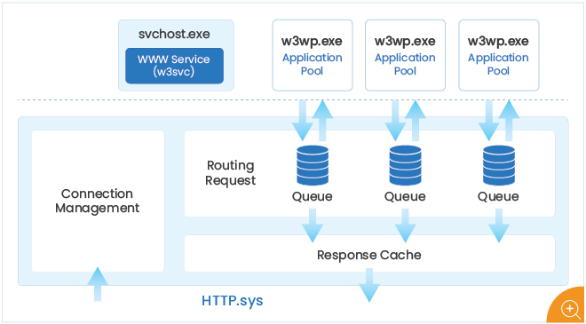](img/iis-server-architecture.jpg)

*Figure 1: Architecture of a Microsoft IIS Server*

1.  **HTTP.sys:**This is a kernel component of IIS. That is, this is not a part of user mode processes. A kernel component never uses any virtual memory addresses of user processes. It is isolated and separated from user processes. HTTP.sys listens for HTTP and HTTPS requests, and validates each one before passing it to a worker process. If no worker process is available to handle a request, HTTP.sys places the request in a kernel-mode queue.

    HTTP.sys has several important roles – (client) connection management, routing requests from browsers, requesting pre-processing and security filtering, and managing the response cache.

    When it routes requests, http.sys dispatches requests to the correct ‘Application Pool Queue’ for each worker process.

2.  **Worker Processes**: W3WP (WWW Worker Process) conducts the main work of a web server: handling client requests and serving responses. IIS can handle requests with multiple worker processes at a time (depending on your configuration), each of which runs as an executable w3wp.exe.

    Static content, such as HTML/GIF/JPG files are transmitted by it when requests to these files are received. The worker process is also responsible for generating dynamic content. For example, by supporting ASP/ASP.NET applications. Therefore, the status of W3WP processes is critical for the performance and stability of web applications, or websites hosted on an IIS server.

3.  **IIS Admin Service**: The key component here is the World Wide Web Publishing Service (WWW Service) which runs as a process – svchost.exe. This service passes IIS configuration settings to HTTP.sys and collects performance metrics.

IIS uses a concept of **application pools** to ensure reliability and manageability. An application pool is a group of one or more worker processes, configured with common settings that serve requests to one or more applications that are assigned to that application pool. Because application pools allow a set of Web applications to share one or more similarly configured worker processes, they provide a convenient way to isolate a set of Web applications from other Web applications. Process boundaries separate each worker process. Therefore, application problems in one application pool do not affect websites or applications in other application pools.

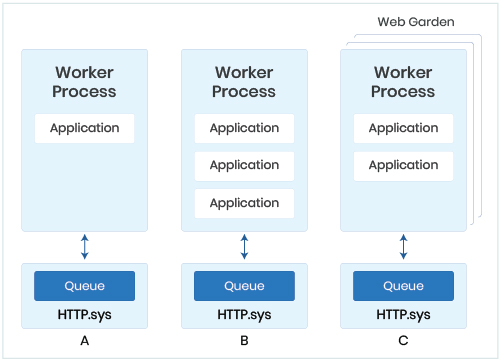

*Figure 2: Different configurations of applications, worker processes, and application pools*

Figure 2 shows different configurations of applications, worker processes, and application pools. While (A) shows one worker process supporting one web application, (B) shows one worker process supporting multiple web applications. (C) shows a configuration of multiple worker processes supporting one or more web applications. This configuration is referred to as a **web garden**.

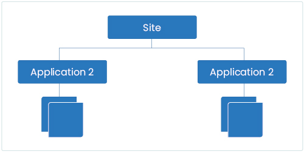

*Figure 3: Mapping of application pools, applications, and sites in an IIS server*

Routing of a request to an application pool by HTTP.sys is based on their URI of the request. The main component of a URL is a site – which maps to an IP address, a TCP port, and a host header. A site can have multiple applications. Each application can map to an application pool.

### Top 10 Key Metrics to Monitor for an IIS Server

Having looked at the architecture of Microsoft IIS, let’s now turn our attention to what are the key metrics to monitor regarding a Microsoft IIS server. Clearly, as IIS runs as an application on a Windows operating system, it is essential to monitor all the key operating system parameters. CPU utilization, memory utilization, activity of each of the disk drives, usage of handles in the operating system, page file usage, etc., are just a few of the key metrics to be tracked at the OS layer. To [ensure that IIS is working](https://www.eginnovations.com/iis-monitoring), it is important to monitor the status of the World Wide Web Publishing service.

**\#1 Monitor IIS Availability and Response Time**: Sometimes, the service could be up, but the IIS server may not be responding to incoming requests. [Synthetic monitoring](https://www.eginnovations.com/synthetic-monitoring) is recommended to ensure that IIS is monitored at all times. Synthetic monitoring involves protocol emulation – either HTTP, FTP or NTP requests are issued to IIS and the response is checked to ensure that the service is responding. The time taken for the response is compared with prior baselines to determine if IIS is performing up to expectation.

**\#2 Monitor the workload on your IIS server and individual websites**: IIS response times could degrade because of excessive load on it. Therefore, it is important to track the workload of the IIS server – how many requests/second is it processing?

Comparing the request rate across all IIS servers in your server farm can help you determine whether your workload is being balanced across all the servers. Workload imbalance can result in performance bottlenecks and must be addressed quickly.

When an IIS server supports multiple websites, it is important to know which site is receiving the most requests. Along with load, it is essential to track the responses from the server. Is the server generating any error responses – 400 errors? 500 errors? Which site is seeing the most errors?

**\#3 Get granular details on website performance**: Break down responses with 400 and 500 status codes further by website to identify the cause of error responses from each website to clients. For example, which URLs are causing not found errors, which ones have logon failures, are there URLs seeing authorization failures, did the server respond with busy errors and at what times, etc. Report average response time for accesses to each website and identify the slowest URLs by response time during each measurement period. This granular level of detail per website can be obtained by analyzing the IIS server’s access log in real time.

[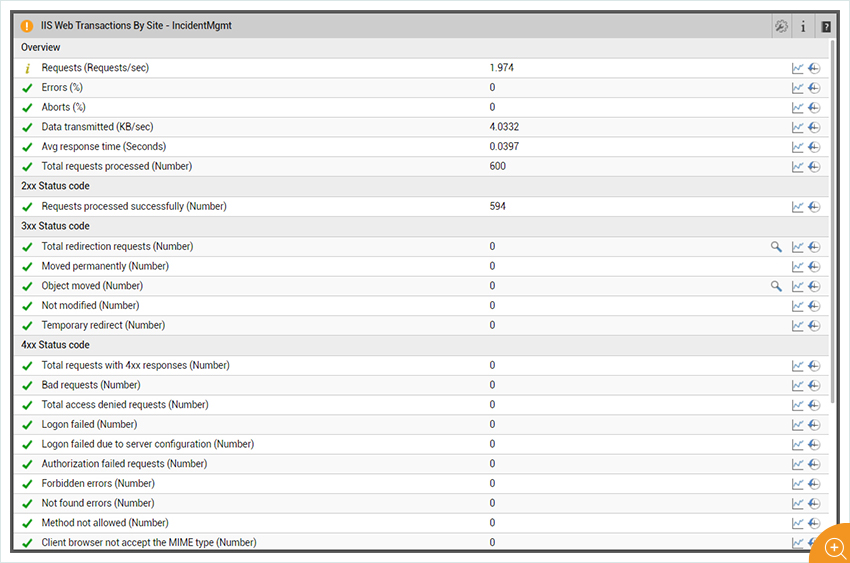](img/iis-performance-dashboard.jpg)

*Figure 4: Overall performance of an IIS website*

**\#4 Snapshot requests currently executing for each website and identify requests that are being processed slowly**: Track the currently executing requests for each website. Ideally, this number should be as small as possible. If the number of currently executing requests is growing for a website, this means that requests are piling up and could lead to higher latencies and request queueing.

Monitor the processing time for each currently executing request and alert if the processing time exceeds a preset limit, highlighting that a specific request has been executing for a long time. The URL being accessed is highlighted. If the hang is being caused by a specific ASP.NET controller or page, the module will indicate if it is IsapiModule (classic mode) or ManagedPipelineHandler (integrated mode). Typically, this analysis points to specific URLs that may be causing slowness when accessing a website.

[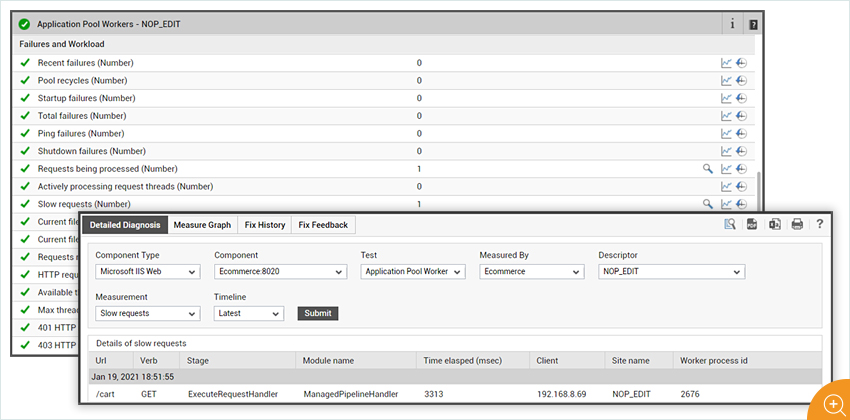](img/slow-iis-requests.jpg)

*Figure 5: Identifying slow requests on an IIS web server*

Now, let’s go deeper into the IIS components that could cause slowness in request processing. Most of the requests to an IIS server are processed by the .NET runtime. The figure below shows how this processing happens.  A request is first received by HTTP.sys and added in the queue of the corresponding application pool at kernel level. One IIS worker thread takes the request from the queue and passes it to the ASP.NET queue after its processing. The request may get returned from IIS itself if it is not an ASP.NET request. A thread from the CLR (Common Language Runtime) thread pool gets assigned for processing the request. ASP.NET doesn’t create any thread or own any thread pool to handle the request; instead, it gets a thread from the CLR thread pool.

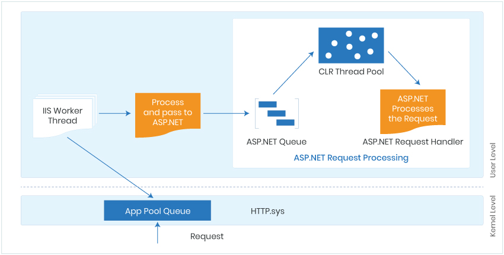

*Figure 6: How ASP.NET requests are received and processed within an IIS web server*

**\#5 Look out for ASP.NET exceptions in the Application Event log**: If a request to an ASP.NET application generates a 500 error, it is most likely that the error is due to an unhandled ASP.NET exception. To find it, go to the Application EventLog and look for Warning events from the appropriate ASP.NET version. The details of the warning will point you to your application logic that could be causing the exception.

**\#6 Monitor .NET Processing Efficiency**: For each .NET application, track the following metrics:

-   **Requests in the application queue**: If this number is high, your server may not be able to handle requests fast enough.
-   **Requests executing currently**: A sustained high value is an indicator of high load on the .NET runtime.
-   **Request execution time**: If this value increases, it may be indicative of a problem with the application logic or in the .NET runtime.
-   **Request waiting time**: This is the time period for which the last request was held in queue before it was taken for processing by the .NET runtime. For good performance, this value should be close to 0. A value closer to 1 sec is indicative of a .NET processing bottleneck on the IIS server.

In addition to the above metrics, check for .NET processing errors. Unhandled runtime errors are indicative of exceptions that would have been visible to users and hence, must be tracked. Total errors, including errors during compilations, pre-processing, and execution should also be monitored to determine anomalous situations.

[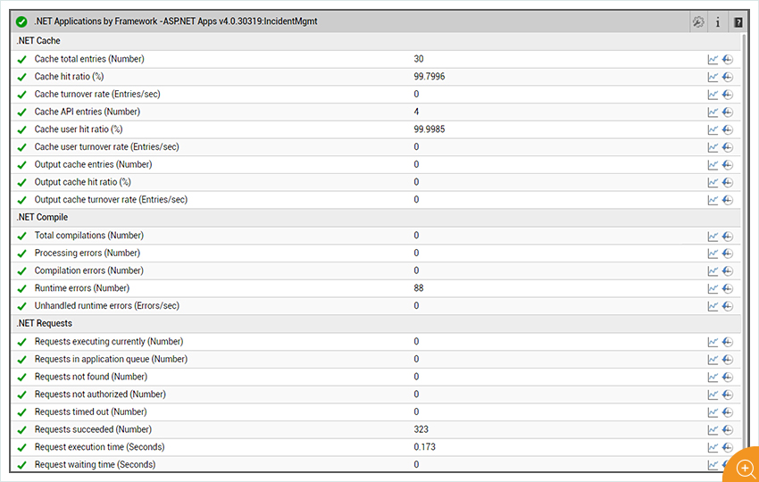](img/monitoring-dot-net-performance.jpg)

*Figure 7: Monitoring .NET processing performance*

**\#7 Monitor .NET CLR Engine**: Each worker process has a .NET CLR. One of the key performance measures of the .NET CLR engine is the percentage of time spent in garbage collection. If a process spends more than 5% of time in garbage collection, this may be indicative of object allocation problems in your application.

Threads in the CLR can acquire and release locks. When multiple threads execute in parallel, this can create contention. Track the number of contentions for locks in the CLR. Also track the queue length – i.e., the number of threads that are currently waiting to acquire a managed lock in the application. These metrics can be indicative of multi-thread contention bottlenecks.

[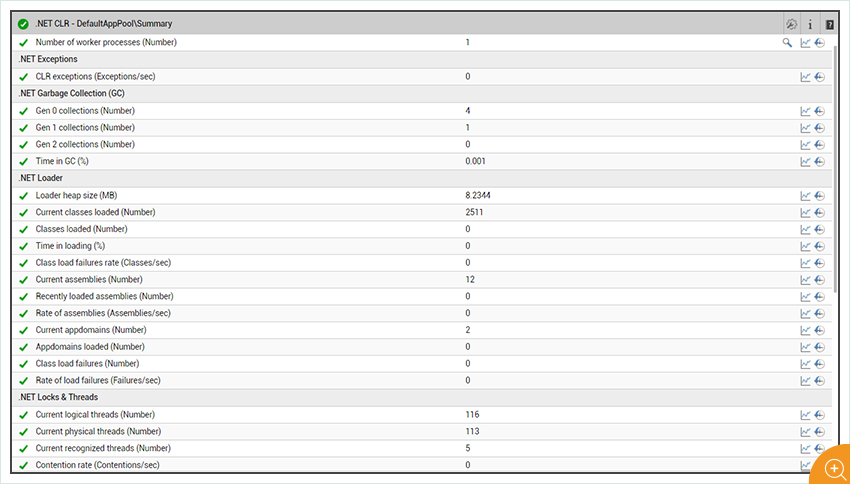](img/monitoring-clr-engine.jpg)

*Figure 8: Monitoring the .NET CLR engine*

**\#8 Monitor Application Pools and Worker Processes**: As we have seen, application pools and worker processes are integral to processing of requests by IIS. Hence, it is essential to monitor them. Key metrics to collect regarding application pools include:

-   Current state of the application pool; alert if a pool is inadvertently stopped.
-   Track uptime of each application pool and detect if any unusual restarts have happened recently.
-   Monitor the number of worker processes running in each pool and the resources used – CPU, memory, IOPS, OS handles used, etc. Comparing the resource utilization across application pools can reveal which application pool may have resource usage issues.
-   Report rate of requests to each application pool, failures in processing in the application pool and if there are excessive running threads in any pool.

**\#9 Windows Process Activation Service (WAS)**: The Windows Process Activation Service (WAS) of IIS is the key component that provides process model and configuration features to Web Applications and Web Services. WAS’ major task is to manage application pools. For each application pool, track the active listener and protocol channels. Time taken to respond to WAS messages is another important measure of the health of the worker processes in each application pool.

**\#10 HTTP.sys Performance**: Requests from clients have to pass through HTTP.sys, which handles the TCP connections, before they reach the IIS worker processes for processing.

HTTP.sys also establishes the SSL/TLS SChannel used in HTTPS. Request validation happens in HTTP.sys; for instance, too large an HTTP request header may cause rejection. And with certain configurations, HTTP.sys also performs the Windows Authentication of HTTP requests with Kerberos. All these happen before relaying requests to IIS; any failure here would prevent an HTTP request from reaching IIS. If requests are not getting to IIS, the HTTPERR log file (may reveal why Requests rejected by HTTP.sys will not show up in the web server’s access logs. Hence, looking at the access logs alone is not sufficient).

HTTP.sys rejections can happen for several reasons: a request violated the HTTP protocol (client saw HTTP 400: Bad Request) or there was a WAS/the application pool failure (client saw HTTP 503: Service Unavailable). Monitoring of the HTTPERR log reveals many such error conditions.

[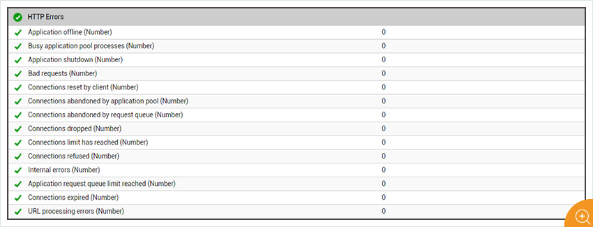](img/tracking-https-sys-errors.jpg)

*Figure 9: Tracking any HTTP.sys errors*

Microsoft also recommends monitoring for spikes in *Timer\_ConnectionIdle* messages, which appear when a client’s connection has reached its keep-alive timeout. An increase in the number of Timer\_ConnectionIdle messages may be indicative of DoS attacks to your server. These messages can also occur if several users are having issues with connectivity. Hence, it is important to track these messages, but additional investigation is needed to diagnose if this is a connectivity issue or an attack.

Additionally, it is important to monitor the HTTP.sys application pool queue. Requests are first queued in the HTTP.sys’ application pool queue and IIS worker processes have to dequeue these requests. When the worker processes are slow to dequeue, requests accumulate in this queue. The application pool’s configured *queueLength* attribute determines how many requests are stored in the queue. By default, the *queueLength* is 1000. When this limit is reached, HTTP.sys returns a 503 Service Unavailable response. Hence, it is critical to monitor the requests in this queue. At the same time, also track the request rejection rate, which is another sign of an IIS bottleneck.  Another important attribute is age of oldest requests in queue (age of the last request in the queue). This can give an idea of the queueing delay at the HTTP.sys layer.

[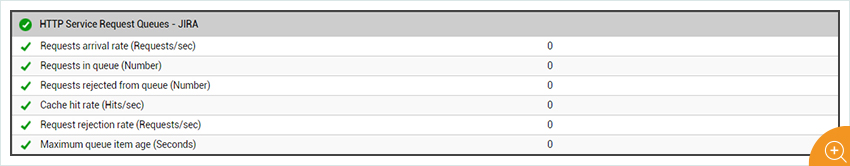](img/monitoring-https-request-queues.jpg)

*Figure 10: Monitoring request queues at the HTTP.sys layer. An increase in request queue length is an indicator of potential request rejections in future*

### Comprehensive Microsoft IIS Performance Monitoring with eG Enterprise

As you’ve read in this blog so far, there are hundreds of metrics to track regarding the performance of a Microsoft IIS Server. eG Enterprise greatly simplifies and automates [monitoring of Microsoft IIS](https://www.eginnovations.com/iis-monitoring):

[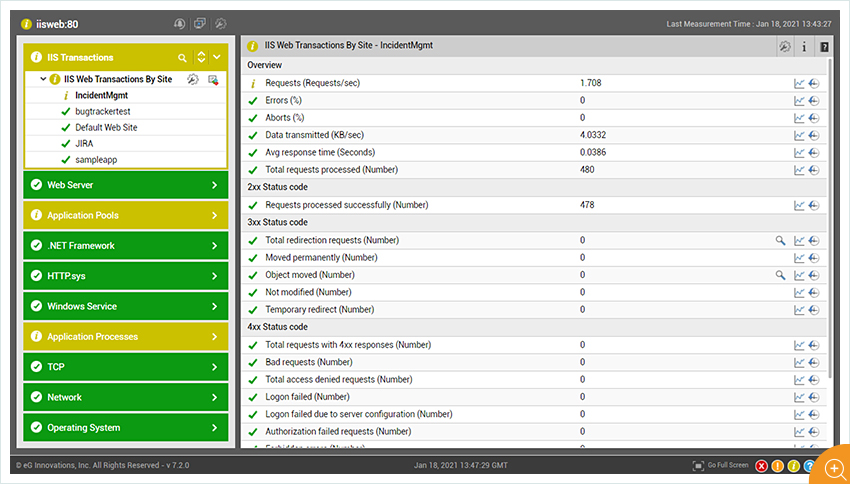](img/iis-web-server-layer-model.jpg)

*Figure 11: Comprehensive layer model of an IIS web server in eG Enterprise*

-   eG Enterprise agents have built in capability to collect all the KPIs regarding Microsoft IIS on an on-going basis. The profile of Microsoft IIS, built into the solution, dictates what metrics to collect and at what frequency.
-   Baselines configured in the system indicate the expected range of each metric. eG Enterprise also auto-baselines key usage metrics, so if there is unusual activity or usage or queueing in any of the IIS components, eG Enterprise can proactively alert administrators to this situation.
-   Rather than provide a ton of measurements on a dashboard, eG Enterprise groups metrics by functional layers, so it is very simple to understand which layers are performing well and which are not. For instance, is an IIS performance issue due to insufficient hardware/OS configuration, or due to errors in the application stack, or due to a memory leak in one of the application pools?
-   Performance metrics collected by eG Enterprise can be analyzed to determine trends for post-mortem diagnosis of problems and for intelligent capacity planning.